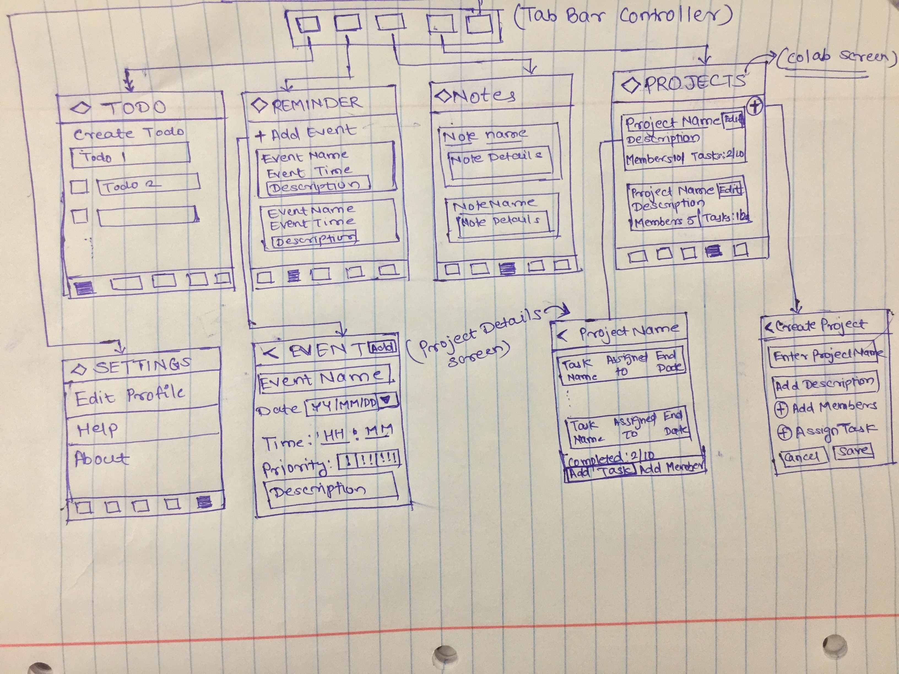

# Colab

## Table of Contents
1. [Overview](#Overview)
1. [Product Spec](#Product-Spec)
1. [Wireframes](#Wireframes)

## Overview
### Description
Colab is a task manager app that helps you organize,plan,track your tasks.Colab can be used by individual as well as by organizations. It allows to create a new task or project add members to project and assign subtasks to them.Colab will notify you about upcoming deadlines project deliverables through push notifications and email.

### App Evaluation
- Category: Task/Work Management 
- Mobile: This app will be developed for mobile but would perhaps be just as viable on a computer, such as Notion or other similar apps. 
- Story: Provides a interface to create a group, add members, assign tasks to members. App will also show work progress details.Also app provides functionality to create todolist.
- Market: Any individual could use this app but app will be more useful to people who are working on a project. 
- Habit: This app would be used regularly or as per the needs. 

## Product Spec

### 1. User Stories (Required and Optional)

Required Must-have Stories

* New user can register through app.
* Active user must be able to login into app.
* Can create personalized to do list.
* Can set reminders for an event.
* Can create notes to save personal details.
* A user can create a project and add members, assign task set deadlines.

Optional Nice-to-have Stories
* Integrate with Apple calender.
* Private chat rooms for each project group.
* File sharing.

### 2. Screen Archetypes

* On Board Screen
   * This screen will inform new users about the features of app, it will also have a button to navigate to signup screen. If already a member user can navigate to login screen.
  
* Login Screen
   * User can use email id to login into application.
   * User can reset password.
   
* Registration Screen.
    * User creates an account by providing the neccessary information.
* Todo Screen.
    * Allows user to add a todo. 
    * User is provided a checkbox to mark a todo as completed.
* Reminder Screen.
    * Allows user to create reminder for an event.
    * Event details such as date, time and description(optional) are to be filled.
    * User can also set the priority of the event.
* Notes Screen.
    * Allows user to store important credentials and personal details for easy access.
* Colab Screen.
    * Allows user to create a project group, add members and assign task.
    * Allows to set a deadline (end date) by which the task needs to be completed. 
* Settings Screen.
    * Allows user to view and edit his profile.
    * Provides help to user for using the application.

### 3. Navigation

Tab Navigation (Tab to Screen)

* Colab
* Todo 
* Reminder 
* Notes 
* Settings

Flow Navigation (Screen to Screen)

* OnBoard Screen
   * OnBoard Screen -> Registration screen for new user 
   * OnBoard Screen -> Login screen for active user 
* Registration Screen
   * Registration Screen -> Login Screen (After registration) 
* Login Screen 
   * Login Screen -> Main Screen (Tabs) if sucessfully authenticated. 
* Colab Screen 
   * Colab Screen -> Create Project Screen (on click of "+" Button on navigation bar)
   * Colab Screen -> Project Details Screen (on tap of list item)
* ToDo Screen -> can create new todo 
* Reminder Screen
    * Reminder Screen -> Create Event Screen (on click of "+" Button on navigation bar)
* Notes Screen
    * Notes Screen -> Create Note Screen (on click of "+" Button on navigation bar)
* Setting Screen -> can edit profile.

## Wireframes



## Schema 
### Models
#### User

   | Property     | Type     | Description |
   | ------------ | --------  | ------------|
   | user_id      |  String  | unique id for each registered user (default field) |
   | email        |  String  | Email used for registration |
   | first_name   |  String  | First name of the user |
   | last_name    |  String  | last name of the user |
   | dob          | DateTime | Date of birth of the user |
   | user_auth_id | String   | authentication id received from firestore |
   
#### Notes

   | Property      | Type    | Description |
   | ------------- | ------- | ------------|
   | note_id       |  String  | unique id for each note created |
   | user_auth_id  |  String | unique id associated with all authenticated user |
   | note_title    |  String | Title for the note |
   | note_desc     |  String | Detailed description for the note |

#### Reminder

   | Property      | Type    | Description |
   | ------------- | ------- | ------------|
   | reminder_id   |  String | unique id for each reminder created |
   | user_auth_id  |  String | unique id associated with all authenticated user |
   | title         |  String | Title for the remainder |
   | desc          |  String | Detailed description of the event for which remainder is created |
   | date          |  String | Date for notifying the user about the event |
   | time          |  String | Time when the user should be notified |
   
#### Checklist

   | Property      | Type    | Description |
   | ------------- | ------- | ------------|
   | checklist_id  |  String | unique id for each checklist item created |
   | user_auth_id  |  String | unique id associated with all authenticated user |
   | title         |  String | Checklist title |
   | status        |  String | Whether the task is completed or not.  |

### Networking
#### List of network requests by screen
   - Todo Screen 
      - (Create/POST) Create a new checklist item (todo) 
        ```swift
        Firestore.firestore().collection(CHECKLIST_REF).addDocument(data: [STATUS : "incomplete",
            TITLE: todoDesc, USER_ID: "tq3fiRpP3YgFZWDWhIdMKxrIbit1"]) { (err) in
        if let err = err{
            print(todoDesc)
            print("Unable to publish")
            debugPrint("Error adding \(err)")
        }
        else{
                print("Document added")
        }
        
      - (Read/GET) Query all checklist items(todo) 
         ```swift
                 checklistCollectionRef.getDocuments { (snapshot, err) in
            if let err = err{
                debugPrint("Error fetching documents\(err)")
            }else{
                guard let snap = snapshot else {return}
                for document in snap.documents{
                        let data = document.data()
                        let checklist_id = data["checklist_id"] as? String ?? ""
                        let status = data["status"] as? String ?? "incomplete"
                        let title = data["title"] as? String ?? "Title"
                    
                    let newTodo = Checklist(checklist_id: checklist_id, status: status, title: title)
                    self.todos.append(newTodo)
                    
                }
                self.tableView.reloadData()
            }
        }
         ```
      - (Delete) Delete existing todo
      - (Update/PUT) Update an existing todo
   
   - Notes Screen
      - (Create/POST) Create a new note for an user 
      - (Read/GET) Query all notes created by the user
      - (Delete) Delete an existing note
      - (Update/PUT) Update an existing note 
      
   - Reminder Screen
      - (Create/POST) Create a new reminder for an event
      - (Read/GET) Query all existing reminders for an user
      - (Delete) Delete existing reminder
      - (Update/PUT) Update an existing reminder
     
     
   
   

   
   
   
